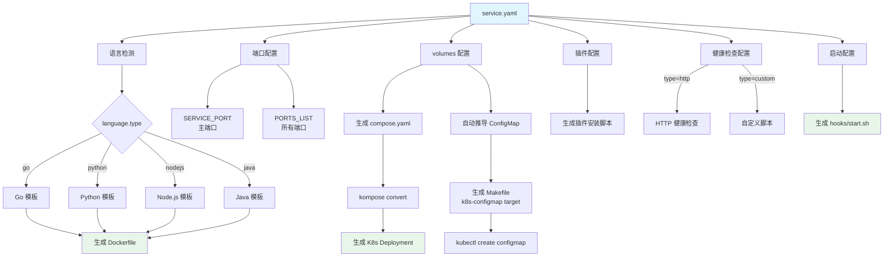

# 🎯 TCS Service Template Generator 配置化改进方案（最终版）

## 📋 方案概述

将现有的 Shell 脚本生成工具重构为基于 **Go + service.yaml** 的配置化生成工具，实现：
- ✅ **单一配置源**：所有用户配置集中在 `service.yaml`
- ✅ **自动化推导**：Docker、K8s 配置自动从 service.yaml 生成
- ✅ **增量更新**：修改配置后可安全重新生成，保护用户自定义内容
- ✅ **语言无关**：支持 Go、Python、Node.js、Java 等多种语言

---

## 🏗️ 项目结构

```
tcs-service-template/
├── cmd/
│   └── tcs-gen/
│       └── main.go                    # CLI 入口
│
├── pkg/
│   ├── config/
│   │   ├── types.go                   # 配置结构定义
│   │   ├── loader.go                  # YAML 配置加载器
│   │   └── validator.go               # 配置验证器
│   │
│   ├── generator/
│   │   ├── generator.go               # 核心生成器
│   │   ├── template.go                # 模板引擎封装
│   │   ├── variables.go               # 变量处理
│   │   ├── dockerfile.go              # Dockerfile 生成器
│   │   ├── compose.go                 # Compose 生成器
│   │   ├── makefile.go                # Makefile 生成器
│   │   ├── scripts.go                 # 脚本生成器
│   │   ├── configmap.go               # ConfigMap 生成器
│   │   ├── plugins.go                 # 插件处理器
│   │   └── ports.go                   # 端口处理器
│   │
│   └── utils/
│       ├── file.go                    # 文件操作工具
│       ├── package_manager.go         # 包管理器检测
│       └── merge.go                   # 配置合并工具
│
├── templates/
│   ├── languages/                     # 语言特定模板
│   │   ├── go/
│   │   │   ├── Dockerfile.amd64.tmpl
│   │   │   ├── Dockerfile.arm64.tmpl
│   │   │   ├── devops.yaml.tmpl
│   │   │   ├── deps_install.sh.tmpl
│   │   │   ├── build.sh.tmpl
│   │   │   └── rt_prepare.sh.tmpl
│   │   │
│   │   ├── python/
│   │   │   ├── Dockerfile.amd64.tmpl
│   │   │   ├── Dockerfile.arm64.tmpl
│   │   │   ├── devops.yaml.tmpl
│   │   │   ├── deps_install.sh.tmpl
│   │   │   ├── build.sh.tmpl
│   │   │   └── rt_prepare.sh.tmpl
│   │   │
│   │   ├── nodejs/
│   │   ├── java/
│   │   └── ...
│   │
│   ├── common/                        # 通用模板
│   │   ├── Makefile.tmpl
│   │   ├── compose.yaml.tmpl
│   │   ├── healthcheck.sh.tmpl
│   │   └── start.sh.tmpl
│   │
│   └── hooks/                         # 钩子脚本模板
│       ├── healthchk.sh.tmpl
│       └── start.sh.tmpl
│
├── service.yaml.example               # 配置文件示例
├── go.mod
├── go.sum
├── Makefile                           # 工具自身的构建文件
└── README.md
```

---

## 📝 service.yaml 配置文件（最终版）

```yaml
# ============================================
# TCS Service Configuration
# Version: 2.0
# ============================================

# ============================================
# 基础服务信息
# ============================================
service:
  name: apm-async-task
  description: "APM Async Task Service"
  
  # 服务端口配置（支持多端口）
  # 可用变量：SERVICE_PORT（主端口，取第一个端口）
  ports:
    - name: http
      port: 8080
      protocol: TCP
      expose: true
      description: "HTTP API port"
    
    - name: metrics
      port: 9090
      protocol: TCP
      expose: false
      description: "Prometheus metrics"
  
  deploy_dir: /usr/local/services

# ============================================
# 语言和版本配置
# ============================================
language:
  type: go                              # go | python | nodejs | java | rust
  version: "1.23"
  config:
    # Go 特定配置
    goproxy: "https://goproxy.cn,direct"
    gosumdb: "sum.golang.org"
    
    # Python 特定配置（示例）
    # pip_index_url: "https://mirrors.tencent.com/pypi/simple"
    # pip_trusted_host: "mirrors.tencent.com"
    
    # Node.js 特定配置（示例）
    # npm_registry: "https://mirrors.tencent.com/npm/"

# ============================================
# 构建配置
# ============================================
build:
  dependency_files:
    auto_detect: true                   # 自动检测依赖文件
  
  # 构建基础镜像（按架构）
  builder_image:
    amd64: "mirrors.tencent.com/tcs-infra/tceforqci_x86_go23:v1.0.0"
    arm64: "mirrors.tencent.com/tcs-infra/tceforqci_arm_go23:v1.0.0"
  
  # 运行时基础镜像（按架构）
  runtime_image:
    amd64: "mirrors.tencent.com/tencentos/tencentos3-minimal:latest"
    arm64: "mirrors.tencent.com/tencentos/tencentos3-minimal:latest"
  
  # 构建阶段系统依赖
  # 工具会自动检测包管理器（apt-get/yum/apk/dnf/zypper）
  system_dependencies:
    build:
      packages:
        - git
        - make
        - gcc
  
  # 构建命令（三阶段）
  # 可用变量：
  #   ${SERVICE_NAME}       - 服务名称
  #   ${SERVICE_ROOT}       - 服务根目录
  #   ${BUILD_OUTPUT_DIR}   - 构建输出目录
  #   ${DEPLOY_DIR}         - 部署目录
  #   ${GOARCH}             - Go 架构（仅 Go）
  #   ${GOOS}               - Go 操作系统（仅 Go）
  commands:
    pre_build: |
      echo "Pre-build stage"
      go version
    
    build: |
      cd ${SERVICE_ROOT}
      CGO_ENABLED=0 go build -ldflags="-s -w" -o ${BUILD_OUTPUT_DIR}/bin/${SERVICE_NAME} ./cmd/server
      cp -r configs ${BUILD_OUTPUT_DIR}/
      cp -r scripts ${BUILD_OUTPUT_DIR}/
    
    post_build: |
      echo "Post-build completed"
  
  output_dir: dist

# ============================================
# 插件配置
# ============================================
plugins:
  - name: selfMonitor
    description: "TCE Self Monitor Tool"
    download_url: "https://mirrors.tencent.com/repository/generic/selfMonitor/download_tool.sh"
    install_dir: /tce
    # 可用变量：
    #   ${PLUGIN_NAME}           - 插件名称
    #   ${PLUGIN_DESCRIPTION}    - 插件描述
    #   ${PLUGIN_DOWNLOAD_URL}   - 下载地址
    #   ${PLUGIN_INSTALL_DIR}    - 安装目录
    #   ${SERVICE_NAME}          - 服务名称
    #   ${SERVICE_ROOT}          - 服务根目录
    #   ${BUILD_OUTPUT_DIR}      - 构建输出目录
    install_command: |
      echo "Installing ${PLUGIN_NAME} to ${PLUGIN_INSTALL_DIR}..."
      curl -fsSL "${PLUGIN_DOWNLOAD_URL}" | bash -s "${PLUGIN_INSTALL_DIR}"
      echo "${PLUGIN_NAME} installed successfully"
    required: true

# ============================================
# 运行时配置
# ============================================
runtime:
  # 运行时系统依赖
  # 工具会自动检测包管理器
  system_dependencies:
    packages:
      - ca-certificates
      - tzdata
  
  # 健康检查配置
  healthcheck:
    enabled: true
    type: http                          # http | tcp | exec | custom
    
    # HTTP 健康检查
    http:
      path: /health
      port: 8080
      timeout: 3
    
    # 自定义健康检查脚本（当 type=custom 时使用）
    # 可用变量：
    #   ${SERVICE_NAME}       - 服务名称
    #   ${SERVICE_PORT}       - 主服务端口
    #   ${SERVICE_ROOT}       - 服务根目录
    #   ${CONFIG_DIR}         - 配置目录
    #   ${SERVICE_BIN_DIR}    - 二进制目录
    custom_script: |
      #!/bin/sh
      # Custom health check logic
      curl -f http://localhost:${SERVICE_PORT}/health || exit 1
  
  # 启动配置
  startup:
    # 启动命令
    # 可用变量：
    #   ${SERVICE_NAME}       - 服务名称
    #   ${SERVICE_PORT}       - 主服务端口
    #   ${SERVICE_ROOT}       - 服务根目录
    #   ${CONFIG_DIR}         - 配置目录
    #   ${SERVICE_BIN_DIR}    - 二进制目录
    #   ${DEPLOY_DIR}         - 部署目录
    command: |
      #!/bin/sh
      set -e
      cd ${SERVICE_ROOT}
      export SERVICE_NAME="${SERVICE_NAME}"
      export SERVICE_PORT="${SERVICE_PORT}"
      exec ${SERVICE_BIN_DIR}/${SERVICE_NAME} \
        --config=${CONFIG_DIR}/config.yaml \
        --port=${SERVICE_PORT}
    
    # 环境变量
    env:
      - name: GO_ENV
        value: production
      - name: LOG_LEVEL
        value: info

# ============================================
# 本地开发和测试配置
# ============================================
local_dev:
  # Docker Compose 配置
  compose:
    # 资源限制
    resources:
      limits:
        cpus: "0.5"
        memory: 1G
      reservations:
        cpus: "0.25"
        memory: 512M
    
    # 卷挂载配置（唯一配置源）
    # 工具会自动：
    #   1. 生成 compose.yaml 的 volumes 配置
    #   2. 通过 kompose 转换为 K8s ConfigMap/PVC
    #   3. 自动识别配置文件目录并生成 ConfigMap
    volumes:
      - source: ./bk-ci/tcs/build/config.yaml
        target: /usr/local/services/${SERVICE_NAME}/config.yaml
        type: bind
        description: "Service config"
      
      - source: ./bk-ci/tcs/build/sdk.json
        target: /tce/conf/config/tce.config.center/sdk.json
        type: bind
        description: "TCE SDK config"
      
      # 数据卷示例
      # - source: app-data
      #   target: /data
      #   type: volume
      #   description: "Application data"
    
    # 健康检查配置（Docker Compose 格式）
    healthcheck:
      interval: 30s
      timeout: 10s
      retries: 3
      start_period: 40s
    
    # 标签配置
    labels:
      kompose.image-pull-policy: "IfNotPresent"
      reloader.stakater.com/auto: "true"
  
  # Kubernetes 本地部署配置
  kubernetes:
    enabled: true
    namespace: default
    output_dir: k8s-manifests
    
    # 卷类型配置（kompose 转换时使用）
    volume_type: configMap              # configMap | persistentVolumeClaim | emptyDir | hostPath
    
    # ConfigMap 配置（自动推导）
    configmap:
      auto_detect: true                 # 自动从 compose.volumes 推导
      # name: custom-config             # 可选：自定义 ConfigMap 名称
    
    # 部署等待配置
    wait:
      enabled: true
      timeout: 300s

# ============================================
# Makefile 生成配置
# ============================================
makefile:
  # 自定义 Make targets
  custom_targets:
    - name: test
      description: "Run tests"
      commands:
        - go test -v ./...
    
    - name: lint
      description: "Run linter"
      commands:
        - golangci-lint run

# ============================================
# 元数据
# ============================================
metadata:
  template_version: "2.0.0"
  generated_at: ""                      # 自动填充
  generator: "tcs-gen"
```

---

## 🔧 核心技术栈

| 组件 | 技术选型 | 说明 |
|------|---------|------|
| **语言** | Go 1.21+ | 类型安全、跨平台、高性能 |
| **模板引擎** | text/template | Go 标准库，功能强大 |
| **模板函数** | Sprig v3 | 提供 100+ 实用函数 |
| **YAML 解析** | gopkg.in/yaml.v3 | 标准 YAML 库 |
| **CLI 框架** | Cobra | 强大的命令行工具 |
| **配置管理** | Viper | 配置加载和验证 |

---

## 🚀 使用流程

### 1. 安装工具

```bash
# 从源码安装
git clone https://github.com/your-org/tcs-service-template.git
cd tcs-service-template
make install

# 或下载预编译二进制
curl -fsSL https://example.com/install.sh | bash
```

### 2. 初始化配置

```bash
# 在目标项目目录
cd /path/to/your-project

# 生成配置文件模板
tcs-gen init

# 这会创建 service.yaml 文件
```

### 3. 编辑配置

```bash
# 编辑 service.yaml，填写你的服务信息
vim service.yaml
```

### 4. 生成项目

```bash
# 验证配置
tcs-gen validate

# 生成项目文件
tcs-gen generate

# 或一步到位
tcs-gen generate --validate
```

### 5. 构建和运行

```bash
# 本地开发
make docker-build
make docker-up

# K8s 部署
make k8s-deploy

# 清理
make docker-down
```

---

## 📊 配置推导关系图



---

## 🎯 关键特性

### 1. **单一配置源**
- ✅ 所有配置集中在 `service.yaml`
- ✅ 避免配置分散和不一致
- ✅ 配置即文档

### 2. **自动推导**
- ✅ Docker 配置从 service.yaml 生成
- ✅ K8s ConfigMap 从 volumes 自动推导
- ✅ 包管理器自动检测
- ✅ 依赖文件自动识别

### 3. **语言无关**
- ✅ 支持多种编程语言
- ✅ 语言特定模板隔离
- ✅ 通用脚本复用

### 4. **增量更新**
- ✅ 修改配置后可重新生成
- ✅ 保护用户自定义内容
- ✅ 智能合并策略

### 5. **多端口支持**
- ✅ 支持多个服务端口
- ✅ 自动生成端口映射
- ✅ 向后兼容 SERVICE_PORT

### 6. **插件系统**
- ✅ 灵活的插件安装机制
- ✅ 支持多个插件
- ✅ 丰富的变量支持

### 7. **自定义健康检查**
- ✅ 支持 HTTP/TCP/Exec/Custom
- ✅ 可自定义健康检查脚本
- ✅ 变量替换支持

---

## 📈 对比分析

| 特性 | Shell 实现 | Go 实现 | 优势 |
|------|-----------|---------|------|
| **类型安全** | ❌ 无类型 | ✅ 强类型 | 编译时错误检查 |
| **配置验证** | ⚠️ 基础验证 | ✅ 完整验证 | 提前发现配置错误 |
| **模板功能** | ⚠️ sed 替换 | ✅ 强大模板引擎 | 支持条件、循环、函数 |
| **错误处理** | ⚠️ 基础 | ✅ 详细错误信息 | 快速定位问题 |
| **跨平台** | ⚠️ 需适配 | ✅ 原生支持 | 一次编译到处运行 |
| **性能** | ⚠️ 较慢 | ✅ 高性能 | 并发处理 |
| **可维护性** | ⚠️ 较难 | ✅ 易维护 | 结构化代码 |
| **可测试性** | ❌ 难测试 | ✅ 单元测试 | 保证代码质量 |
| **配置管理** | ❌ 分散 | ✅ 集中化 | service.yaml 单一配置源 |
| **自动推导** | ❌ 手动配置 | ✅ 智能推导 | ConfigMap 等自动生成 |

---

## 🛠️ 实施计划

### 阶段 1：基础框架（2周）
- [ ] 项目结构搭建
- [ ] 配置结构定义（types.go）
- [ ] YAML 加载器（loader.go）
- [ ] 配置验证器（validator.go）
- [ ] CLI 框架（Cobra）

### 阶段 2：核心生成器（3周）
- [ ] 模板引擎封装
- [ ] 变量处理系统
- [ ] Dockerfile 生成器
- [ ] Compose 生成器
- [ ] Makefile 生成器
- [ ] 脚本生成器

### 阶段 3：高级特性（2周）
- [ ] ConfigMap 自动推导
- [ ] 包管理器自动检测
- [ ] 插件系统
- [ ] 多端口支持
- [ ] 健康检查生成器

### 阶段 4：语言模板（2周）
- [ ] Go 语言模板
- [ ] Python 语言模板
- [ ] Node.js 语言模板
- [ ] Java 语言模板

### 阶段 5：测试和文档（1周）
- [ ] 单元测试
- [ ] 集成测试
- [ ] 用户文档
- [ ] 示例项目

---

## 📚 示例：完整生成流程

```bash
# 1. 创建新项目
mkdir my-service && cd my-service

# 2. 初始化配置
tcs-gen init
# 生成 service.yaml

# 3. 编辑配置
vim service.yaml
# 填写服务信息

# 4. 验证配置
tcs-gen validate
# ✓ Configuration is valid

# 5. 生成项目
tcs-gen generate
# ✓ Generated Dockerfile (amd64, arm64)
# ✓ Generated compose.yaml
# ✓ Generated Makefile
# ✓ Generated .tad/devops.yaml
# ✓ Generated bk-ci/tcs/build.sh
# ✓ Generated bk-ci/tcs/deps_install.sh
# ✓ Generated hooks/healthchk.sh
# ✓ Generated hooks/start.sh
# ✓ Project generated successfully!

# 6. 构建镜像
make docker-build
# Building for amd64...
# ✓ Image built: my-service:latest-amd64

# 7. 启动服务
make docker-up
# Starting services...
# ✓ Service is running on http://localhost:8080

# 8. 修改配置
vim service.yaml
# 修改端口或其他配置

# 9. 重新生成（增量更新）
tcs-gen generate
# ✓ Updated compose.yaml
# ✓ Updated Makefile
# ✓ Preserved user customizations

# 10. 重新构建
make docker-build docker-up
```

---

## ✨ 核心优势总结

### 🎯 用户体验
- **配置简单**：只需编辑一个 service.yaml 文件
- **一键生成**：运行 `tcs-gen generate` 即可
- **增量更新**：修改配置后可安全重新生成
- **保护自定义**：用户自定义内容不会被覆盖

### 🔧 技术优势
- **类型安全**：Go 强类型系统，编译时错误检查
- **高性能**：并发处理，生成速度快
- **跨平台**：一次编译，到处运行
- **易维护**：结构化代码，单元测试覆盖

### 📦 功能完整
- **多语言支持**：Go、Python、Node.js、Java 等
- **多架构支持**：amd64、arm64
- **多端口支持**：支持多个服务端口
- **插件系统**：灵活的插件安装机制
- **自动推导**：ConfigMap、包管理器等自动识别

### 🚀 开发效率
- **配置即文档**：service.yaml 自带注释说明
- **快速上手**：5 分钟即可生成完整项目
- **标准化**：统一的项目结构和配置
- **可重复**：配置化保证一致性

---

## 🎉 总结

这个方案将现有的 Shell 脚本生成工具升级为：

1. **配置驱动**：service.yaml 作为单一配置源
2. **自动推导**：Docker、K8s 配置自动生成
3. **语言无关**：支持多种编程语言
4. **增量更新**：保护用户自定义内容
5. **类型安全**：Go 实现，编译时错误检查
6. **高性能**：并发处理，生成速度快
7. **易维护**：结构化代码，单元测试覆盖

**核心价值**：
- ✅ 用户只需维护一个 service.yaml 文件
- ✅ 修改配置后运行 `tcs-gen generate` 即可更新所有物料
- ✅ 保护用户自定义内容不被覆盖
- ✅ 提供完整的配置验证和错误提示
- ✅ 支持多语言、多架构、多端口
- ✅ 自动推导 ConfigMap、包管理器等配置

这个方案完全满足你的需求，将繁琐的手动配置转变为简单的配置文件编辑，大大提升开发效率！🚀
